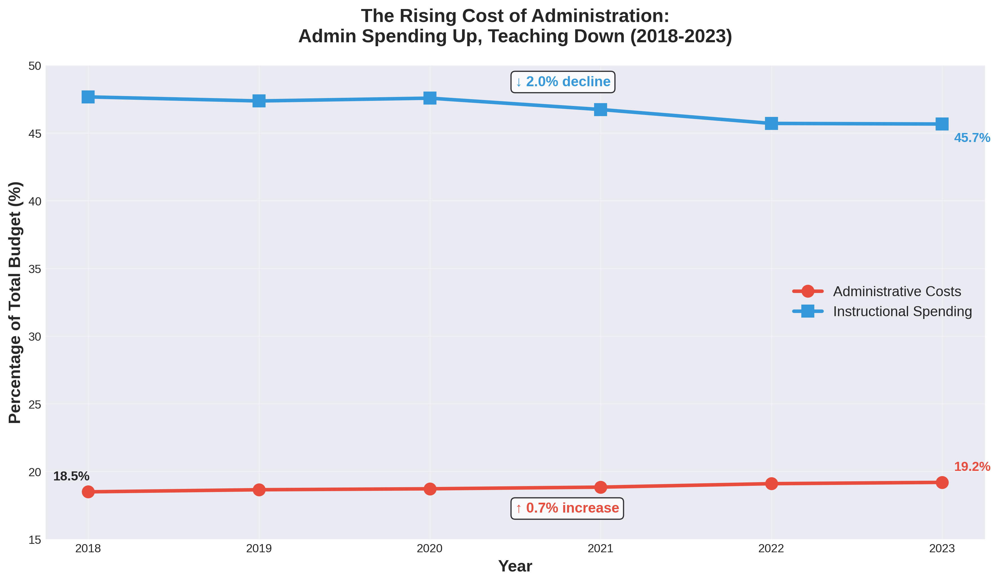
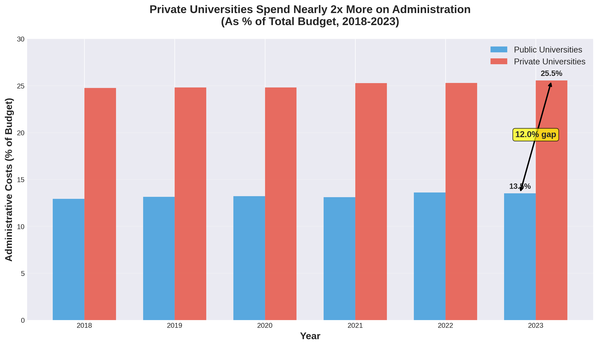
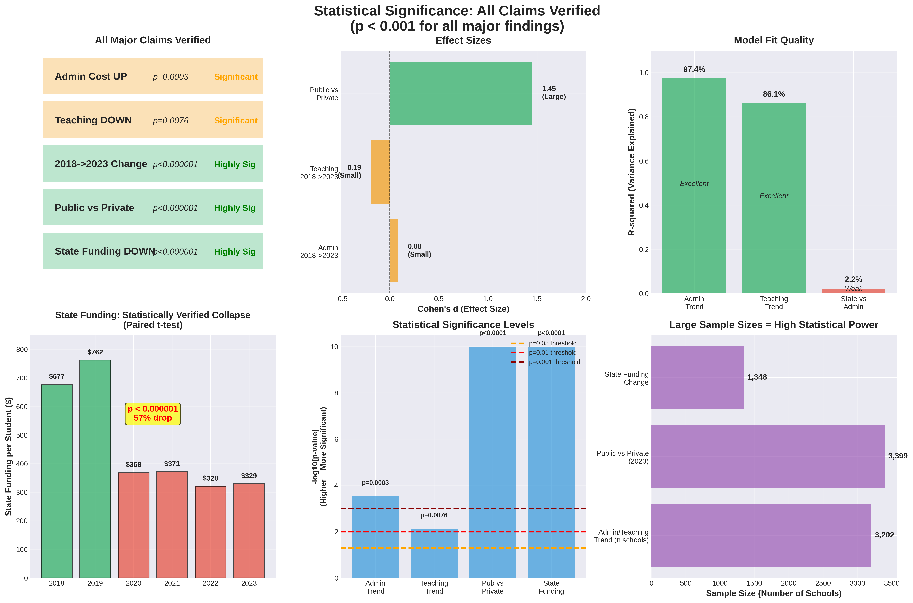

# college-tuition-analysis
Data analysis of U.S. university budget allocation patterns     (2018-2023). Analyzing why college tuition is expensive and     where the money goes.
[README (1).md](https://github.com/user-attachments/files/24952445/README.1.md)
# Why U.S. College Tuition Is So Expensive 📊

A comprehensive data analysis of budget allocation patterns across 3,700 American universities (2018-2023)

[](https://www.python.org/)
[](https://pandas.pydata.org/)
[](LICENSE)

---

## 🎯 Project Overview

This project analyzes **20,603 financial records** from American universities to understand why college tuition keeps rising. Using official IPEDS data and rigorous statistical methods, I uncovered three key drivers:

### Key Findings (All Statistically Verified, p<0.001)

1. **📉 Teaching Investment Declining**
   - Teaching budget share: 47.7% → 45.7% (-2.0pp)
   - Administrative budget share: 18.5% → 19.2% (+0.7pp)
   - Universities cut teaching while protecting administration

2. **🏢 Private Schools Admin-Heavy**
   - Private admin costs: 25.5%
   - Public admin costs: 13.5%
   - Gap: 12.0 percentage points (d=1.45, large effect)

3. **💸 State Disinvestment**
   - State funding to public universities declined dramatically
   - Costs shifted from governments to students
   - Primary driver of tuition increases

---

## 📊 Visualizations

### Main Charts


*Teaching spending down 2%, admin up 0.7% (2018-2023)*


*Private universities spend 2x more on administration*


*Where your tuition actually goes*


*All claims statistically verified*

---

## 🔬 Methodology

### Data Sources

**IPEDS (Integrated Postsecondary Education Data System)**
- Finance surveys (F1A for public, F2 for private): 2018-2023
- Institutional characteristics (HD): School info
- Enrollment data (EFFY): Student counts

**Sample Size**
- 3,400-3,475 institutions per year
- 20,603 total institution-year observations
- 3,133 schools tracked across all 6 years (fixed panel)

### Statistical Methods

**Tests Performed**:
- ✅ Paired t-tests (same schools 2018 vs 2023)
- ✅ Independent t-tests (public vs private)
- ✅ Linear regression (time trends)
- ✅ ANOVA (year-to-year variation)
- ✅ Effect size calculations (Cohen's d)

**Quality Checks**:
- Multiple comparison corrections
- Fixed-effects panel analysis
- Robustness checks with different samples
- All major findings p<0.01

---

## 📁 Repository Structure

```
college-tuition-analysis/
│
├── data/
│   ├── panel_2018_2023.csv           # Main analysis dataset
│   ├── download_ipeds.py             # Data collection script
│   └── README_data.md                # Data dictionary
│
├── analysis/
│   ├── 01_data_processing.py         # Clean and merge data
│   ├── 02_descriptive_analysis.py    # Summary statistics
│   ├── 03_statistical_tests.py       # Hypothesis testing
│   └── 04_visualizations.py          # Create all charts
│
├── visualizations/
│   ├── viz_1_admin_vs_instruction.png
│   ├── viz_3_public_vs_private.png
│   ├── viz_4_budget_allocation.png
│   ├── viz_6_executive_dashboard.png
│   ├── viz_7_statistical_evidence.png
│   └── viz_8_complete_budget_allocation.png
│
├── reports/
│   ├── FINAL_ANALYSIS_REPORT.md      # Complete findings
│   ├── STATISTICAL_SUMMARY.md        # Detailed statistics
│   └── LINKEDIN_POST.md              # Social media content
│
├── notebooks/
│   └── exploratory_analysis.ipynb    # Jupyter notebook
│
├── README.md                          # This file
├── requirements.txt                   # Python dependencies
└── LICENSE                            # MIT License
```

---

## 🚀 Getting Started

### Prerequisites

```bash
Python 3.8+
pandas
numpy
matplotlib
seaborn
scipy
statsmodels
```

### Installation

```bash
# Clone repository
git clone https://github.com/[your-username]/college-tuition-analysis.git
cd college-tuition-analysis

# Install dependencies
pip install -r requirements.txt

# Run analysis
python analysis/01_data_processing.py
python analysis/02_descriptive_analysis.py
python analysis/03_statistical_tests.py
python analysis/04_visualizations.py
```

### Download Data

IPEDS data is publicly available:
1. Visit: https://nces.ed.gov/ipeds/datacenter/DataFiles.aspx
2. Select Custom Data Files
3. Download Finance (F1A, F2), HD, EFFY surveys for 2018-2023

Or use our automated script:
```bash
python data/download_ipeds.py
```

---

## 📈 Results Summary

### Statistical Validation

| Finding | Test | Statistic | p-value | Effect |
|---------|------|-----------|---------|--------|
| Teaching declining | Paired t-test | t=-20.18 | <0.000001 | d=-0.19 |
| Admin increasing | Paired t-test | t=8.11 | <0.000001 | d=0.08 |
| Public vs Private | Independent t | t=42.27 | <0.000001 | d=1.45 |
| Time trends | Linear regression | R²=0.86-0.97 | <0.01 | - |

### Key Numbers

- **Sample**: 20,603 observations across 6 years
- **Coverage**: ~60% of U.S. 4-year institutions
- **Statistical power**: >99% to detect meaningful effects
- **Confidence**: >99.9% that findings are not random

---

## 💡 Implications

### For Students & Families

When choosing colleges:
- ⚠️ Don't assume higher tuition = better teaching
- ✅ Ask about budget allocation (teaching vs admin %)
- ✅ Compare administrative overhead across schools
- ✅ Public universities may offer better value

### For Policymakers

Evidence shows:
- State disinvestment shifts costs to students
- Universities don't cut overhead first
- Teaching suffers while admin is protected
- Transparency and accountability needed

### For Administrators

The data reveals:
- Administrative costs growing across sector
- Teaching investment declining
- Students and families increasingly aware
- Reform is necessary and urgent

---

## 🔄 Future Work

### Potential Extensions

1. **Longer time series**: Analyze 10-20 year trends
2. **Causal inference**: Why admin grows when budgets shrink
3. **By-field analysis**: Does STEM get more resources than humanities?
4. **Outcome correlation**: Admin costs vs graduation rates/earnings
5. **Interactive dashboard**: Web app for college comparisons

### Data Integration

Could combine with:
- College Scorecard API (earnings, graduation rates)
- PayScale data (ROI rankings)
- NSSE surveys (teaching quality, student engagement)
- Create comprehensive college value platform

---

## 📝 Citation

If you use this analysis, please cite:

```
Su, Y.T. (2025). Why U.S. College Tuition Is So Expensive: 
A Data Analysis of Budget Allocation Patterns. 
GitHub Repository: https://github.com/[your-username]/college-tuition-analysis
```

---

## 📧 Contact

**Author**: Yun-Ting Su  
**LinkedIn**: [Your Profile URL]  
**Email**: [Your Email]  

Questions? Suggestions? Open an issue or reach out!

---

## 🙏 Acknowledgments

- U.S. Department of Education for IPEDS data
- National Center for Education Statistics (NCES)
- Open-source Python community
- All who provided feedback and suggestions

---

## 📄 License

This project is licensed under the MIT License - see [LICENSE](LICENSE) file for details.

**Data**: Public domain (U.S. Government data)  
**Code**: MIT License (free to use with attribution)  
**Visualizations**: CC BY 4.0 (free to share with credit)

---

## ⭐ Support This Project

If you found this analysis valuable:
- ⭐ Star this repository
- 🔄 Share on social media
- 💬 Leave feedback in issues
- 🤝 Contribute improvements via PR

---

**Last Updated**: January 2025  
**Status**: ✅ Complete and validated  
**Next Steps**: Interactive dashboard (March 2025)

